# Consumer Attention Mapping System - End-to-End Workflow

This workflow illustrates the complete lifecycle of the Consumer Attention Mapping System, from user authentication to retail analytics and deployment.

```mermaid
flowchart LR

%% ---------------- USERS ----------------
subgraph USER["User Access"]
A([Start]) --> B[User Registration / Login]
B --> C[JWT / OAuth2 Authentication]
C --> D{Role Verification}
D --> E1[Store Manager]
D --> E2[Retail Analyst]
D --> E3[Marketing Manager]
D --> E4[Administrator]
end

%% ---------------- STORE ----------------
subgraph STORE["Store & Shelf Management"]
F[Register Store]
G[Create Shelf Layout]
H[Configure Store Zones]
I[Assign Product Categories]
J[Assign Cameras]
F --> G --> H --> I --> J
end

%% ---------------- VIDEO ----------------
subgraph VIDEO["Retail Camera Pipeline"]
K[Live Camera Feed]
L[Frame Extraction]
M[Image Preprocessing]
K --> L --> M
end

%% ---------------- DETECTION ----------------
subgraph DETECT["Consumer Detection & Tracking"]
N[Person Detection<br/>YOLOv8]
O[Multi-Person Tracking]
P[Unique Shopper ID]
Q[Path Tracking]
R[Zone Tracking]
S[Session Generation]
N --> O --> P --> Q --> R --> S
end

%% ---------------- ATTENTION ----------------
subgraph ATTENTION["Attention Analysis"]
T[Gaze Estimation]
U[Head Pose Analysis]
V[Shelf Attention]
W[Product Focus]
X[Dwell Time]
Y[Repeated Attention]
T --> U --> V --> W --> X --> Y
end

%% ---------------- INTERACTION ----------------
subgraph INTERACTION["Product Interaction"]
Z[Product Viewed]
AA[Product Picked]
AB[Product Returned]
AC[Product Purchased]
AD[Product Comparison]
Z --> AA --> AB --> AC --> AD
end

%% ---------------- BEHAVIOR ----------------
subgraph BEHAVIOR["Consumer Behavior Intelligence"]
AE[Shopping Pattern]
AF[Movement Analysis]
AG[Journey Analytics]
AH[Product Preference]
AI[Consumer Segmentation]
AE --> AF --> AG --> AH --> AI
end

%% ---------------- SEGMENTS ----------------
subgraph SEGMENTS["Consumer Segments"]
AJ[Explorer]
AK[Quick Buyer]
AL[Comparison Shopper]
AM[Impulse Buyer]
AN[Brand Loyal Customer]
end

%% ---------------- HEATMAP ----------------
subgraph HEATMAP["Attention Heatmaps"]
AO[Store Heatmap]
AP[Shelf Heatmap]
AQ[Product Heatmap]
AR[Traffic Heatmap]
AS[Hotspot Detection]
AO --> AP --> AQ --> AR --> AS
end

%% ---------------- SCORING ----------------
subgraph SCORE["Product Attractiveness Engine"]
AT[Attention Score 35%]
AU[Interaction Score 25%]
AV[Pickup Rate 20%]
AW[Conversion Rate 15%]
AX[Repeat Engagement 5%]
AY[Final Product Score]
AT --> AY
AU --> AY
AV --> AY
AW --> AY
AX --> AY
end

%% ---------------- RECOMMENDATION ----------------
subgraph RECOMMEND["Recommendation Engine"]
AZ[Shelf Optimization]
BA[Product Placement]
BB[Promotion Strategy]
BC[Layout Improvement]
BD[Consumer Engagement Suggestions]
AZ --> BA --> BB --> BC --> BD
end

%% ---------------- DASHBOARD ----------------
subgraph DASHBOARD["Analytics Dashboard"]
BE[Store Dashboard]
BF[Retail Dashboard]
BG[Marketing Dashboard]
BH[Admin Dashboard]
end

%% ---------------- REPORTS ----------------
subgraph REPORTS["Reports & Alerts"]
BI[Attention Reports]
BJ[Shelf Reports]
BK[Engagement Reports]
BL[Conversion Reports]
BM[PDF / Excel Export]
BN[Notifications & Alerts]
BI --> BM
BJ --> BM
BK --> BM
BL --> BM
end

%% ---------------- DEPLOY ----------------
subgraph DEPLOY["Deployment"]
BO[Docker]
BP[AWS / Azure]
BQ[Monitoring]
BR[Logging]
BS([End])
BO --> BP --> BQ --> BR --> BS
end

%% ---------------- MAIN FLOW ----------------

E1 --> F
E2 --> F
E3 --> F
E4 --> F

J --> K
M --> N
S --> T
Y --> Z
AD --> AE
AI --> AJ
AI --> AK
AI --> AL
AI --> AM
AI --> AN

AJ --> AO
AK --> AO
AL --> AO
AM --> AO
AN --> AO

AS --> AT
AY --> AZ
BD --> BE
BD --> BF
BD --> BG
BD --> BH

BE --> BI
BF --> BJ
BG --> BK
BH --> BL

BM --> BO
BN --> BO
```

